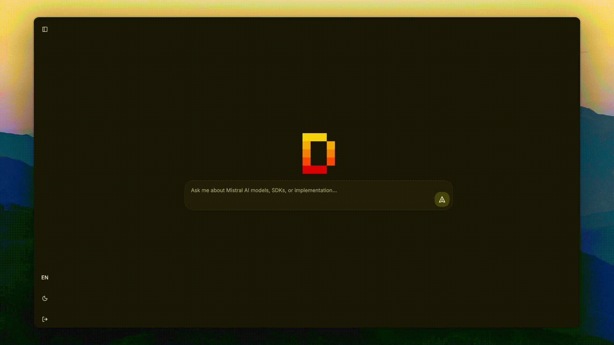

# DocStral

**DocStral** is a sandbox chat application designed to interact with Mistral models and documentation. This is obviously **not an official Mistral project**.

## Motivation

This project serves two main purposes:

1. **Skill Validation & Stack Testing**  
   Continue refining my ability to build fast, production‑ready applications. Validate my tech stack and patterns in preparation for a future open‑source fullstack template.

2. **Deployment & LLMOps Practice**  
   Experiment with deployment tooling (e.g., [Dockploy](https://dockploy.com)), self‑hosting models via [vLLM](https://github.com/vllm-project/vllm), and LLM operations workflows.

This is not a SaaS or commercial product. It's a portfolio project and learning playground to showcase for collaborators, friends or even recruiters.

## Demo



## Tech Stack

I use the following tools to build the application:

### Backend

- [FastAPI](https://fastapi.tiangolo.com) – Modern Python web framework
- [SQLModel](https://sqlmodel.tiangolo.com) – SQL databases with Python type hints
- [Alembic](https://alembic.sqlalchemy.org/en/latest) – Database migrations
- [Black](https://github.com/psf/black) – Code formatting

### Frontend

- [React](https://react.dev) + [TypeScript](https://www.typescriptlang.org)
- [TanStack Router](https://tanstack.com/router/latest) – Type‑safe routing
- [TanStack Query](https://tanstack.com/query/latest) – Server state management
- [Zustand](https://github.com/pmndrs/zustand) – Client state management

### Tooling

- [Docker](https://www.docker.com) + [Docker Compose](https://docs.docker.com/compose) – Containerization
- [Hey API](https://heyapi.dev) – Generate TypeScript SDKs and types from OpenAPI specs

## Quick Start

1. Copy `.env.example` to `.env` and fill in all required environment variables (Mistral API key, database credentials, etc.)
2. Run:

```bash
docker compose up
```

3. Access the application at `http://localhost:5173`

## Project Status

**Current version**: MVP with direct Mistral API calls, minimal auth, and basic chat functionality.

**Next steps**: See [ROADMAP.md](./ROADMAP.md) for the plan to self‑host models, add RAG, and deploy privately.

## Contributing

Contributions, issues, and feature requests are welcome! See [CONTRIBUTING.md](./CONTRIBUTING.md) for guidelines.

## Contact

- **LinkedIn**: [tanguy-pauvret](https://www.linkedin.com/in/tanguy-pauvret)
- **GitHub**: [Bima42](https://github.com/Bima42)

## License

[MIT](./LICENSE)