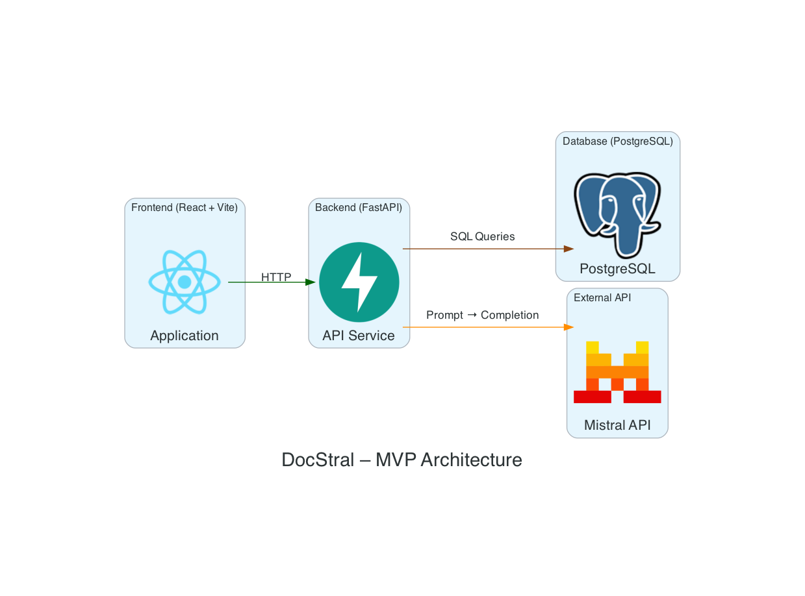

# Roadmap

## V1: MVP (Current)

The first release is a minimal viable product—a "Le Chat"‑like chat application with:

- Simple API calls to Mistral API
- Minimal backend (FastAPI + SQLModel) and database setup
- Basic authentication and data schemas
- Clean, working foundation

## What's Next

### Phase 1: Enhancement and Private Deployment

I will add some chat interaction improvements, like renaming/deleting conversations. 
Deploy the application (likely via [Dockploy](https://dockploy.com)) and keep it private for a limited time. If you'd like early access, reach out directly via [LinkedIn](https://www.linkedin.com/in/tanguy-pauvret) or [GitHub](https://github.com/Bima42).

### Phase 2: Self‑Hosted Model

Replace Mistral API calls with a self‑hosted Mistral model using [vLLM](https://github.com/vllm-project/vllm).
Add more metrics and monitoring to the chat interface.

### Phase 3: RAG System

In parallel with Phase 2:

- Scrape the entire Mistral documentation and model references
- Build a lightweight RAG (Retrieval‑Augmented Generation) system
- Enforce the model to respond **only** to questions related to Mistral and its documentation

## Quality Improvements

As the project matures, expect:

- Automated tests (unit, integration, E2E)
- CI/CD pipelines (linting, formatting, test execution on PRs)
- Enhanced documentation and deployment guides

---

For contribution guidelines, see [CONTRIBUTING.md](./CONTRIBUTING.md).