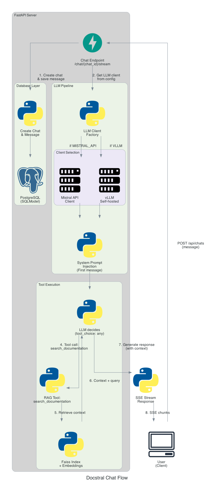

# Roadmap

## V1: MVP (Current)

The first release is a minimal viable product—a "Le Chat"‑like chat application with:

- Simple API calls to Mistral API
- Minimal backend (FastAPI + SQLModel) and database setup
- Basic authentication and data schemas
- Clean, working foundation

## What's Next

### Phase 1: Update Scraper & Ingestion

The Mistral documentation has changed recently. The first priority is to update the scraper and ingestion pipeline to reflect these changes.

### Phase 2: Implement Electron with some features

I would like to improve my knowledge of Electron by creating a desktop version of DocStral.
I don't know yet which features will be included in this version, but I plan to explore the possibilities offered by Electron.

## Quality Improvements

As the project matures, expect:

- Automated tests (unit, integration, E2E)
- CI/CD pipelines (linting, formatting, test execution on PRs)
- Enhanced documentation and deployment guides

---

For contribution guidelines, see [CONTRIBUTING.md](./CONTRIBUTING.md).