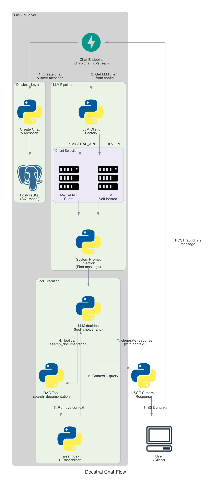

# Server

The server is the backbone of this project, a lightweight Python service built to handle conversations with a LLM that has access to Mistral's documentation. The goal wasn't to build production-grade infrastructure with all the bells and whistles, but rather to create something functional, maintainable, and honest about what it is: a sandbox project for exploring RAG-based chat.

The architecture is deliberately simple. We have a FastAPI server handling HTTP requests, SQLModel for persistence, and a small constellation of modules dealing with the LLM interaction, retrieval, and data processing. Everything lives in Python because, frankly, I didn't want to juggle a Node.js proxy just to keep the LLM tooling where it belongs. Having already tried managing this with Typescript once, I had no desire to repeat the experience.

I've worked with FastAPI enough times to trust it for something like this. It's fast to develop with, the automatic API documentation is genuinely useful, and the async support is first-class. SQLModel felt like a natural companion since it's maintained by the same people and sits cleanly on top of SQLAlchemy. For a project of this scale, it hits the sweet spot between simplicity and capability.

One thing you'll notice is that authentication is... basic. Very basic. That's intentional. This isn't a production system serving real users with real security concerns. It's a closed sandbox, and I didn't want to spend time implementing OAuth flows or JWT refresh logic when the real interesting work was elsewhere. Sometimes the best technical decision is knowing what *not* to build.

---

## Why Python and FastAPI

Let's talk about the foundation. I chose Python not just because I'm comfortable with it, but because when you're working with LLMs, embeddings, and all the associated tooling, Python is simply the path of least resistance. The alternative would have been splitting the stack—maybe a Node.js server proxying requests to a Python service for the LLM work. That architectural complexity felt like a tax I didn't want to pay, especially for a project where iteration speed mattered more than polyglot purity.

FastAPI brings everything I needed to the table. The performance is solid thanks to Starlette and Pydantic under the hood, and the developer experience is genuinely pleasant. Automatic request validation, type hints that actually do something useful, dependency injection that doesn't feel like magic—it all adds up to a framework that gets out of your way. When you're prototyping, that matters.


SQLModel deserves a mention too. It's essentially SQLAlchemy with Pydantic models, which means you get both ORM capabilities and automatic request/response validation from the same class definitions. For a small project, this is exactly the kind of "do more with less" tool you want. Here's a simplified model:

```python
class Chat(SQLModel, table=True):
    __tablename__ = "chats"

    id: uuid.UUID = Field(default_factory=uuid.uuid4, primary_key=True)
    title: str | None = Field(default=None, nullable=True)
    user_id: uuid.UUID = Field(index=True, nullable=False)
    created_at: datetime = Field(
        default_factory=lambda: datetime.now(UTC),
        sa_column=Column(DateTime(timezone=True), nullable=False),
    )

    # Relationships
    messages: List["Message"] = Relationship(back_populates="chat", cascade_delete=True)

```

---

## The LLM Pipeline: From Scraping to Retrieval

The interesting part of this project isn't really the server framework—it's what happens when a user asks a question about Mistral's documentation. **We need to find relevant context**, inject it into the conversation, and let the LLM do its thing. Getting this right meant building a **small but thoughtful data pipeline**.

### Scraping the Documentation

I've worked with BeautifulSoup a couple of times before and had good experiences with it. The doc is clean and has a well structured sitemap which is pure gold for a good experience collecting the content. I opted for a basic fetch, parse HTML and extract.

The tricky part was that the raw HTML structure wasn't ideal. I didn't have clean Markdown to work with, just a pile of divs and spans. So I pulled in `markdownify` to reconstruct something closer to the original documentation structure. It's not perfect, but it was good enough without burning days on a custom parser.

I filtered out the most obvious noises, the good old headers, sidebars and such have no useful information for us. The goal was to extract the *documentation*, not the website chrome around it.

### Embedding and Chunking

Once I had the documentation scraped, I needed to turn it into something a vector database could work with. This meant choosing an embedding model and figuring out how to chunk the content.

For the embedding model, I went to the [MTEB leaderboard](https://huggingface.co/spaces/mteb/leaderboard) on HuggingFace. After some analysis (with a little help from a LLM to parse through the options), I settled on `BAAI/bge-small-en-v1.5`. It's free, reasonably performant for its size (384 dimensions), and it is ranked 87th. I'll let you go and see if you want more details. The top-ranked models are often proprietary and optimized for massive datasets. For a first pass on a relatively small corpus like Mistral's docs, it felt overkill.

My first attempt at chunking was... not great. I tried to split cleanly on heading boundaries (h1, h2, h3) and group small fragments together. The problem was that Mistral's documentation has a lot of tiny h3 sections, and my logic wasn't sophisticated enough to handle them gracefully. I ended up with too many fragments, some of them split in unfortunate places.

So I simplified. I switched to `langchain_text_splitters` and split primarily on h1 and h2 boundaries, letting the tool handle the size-based splitting with more intelligence. I also added metadata to each chunk—title, section hierarchy, source URL. And so I could cite sources properly and give the LLM better context about where information came from.

Here's how the chunking changed things:

| Metric | Before (Header-first) | After (Size-first) | Change |
|--------|----------------------|-------------------|--------|
| **Total chunks** | 1,060 | 737 | ↓ 30%  |
| **Avg words** | 140 | 205 | ↑ 46%  |
| **Median words** | 101 | 212 | ↑ 110% |
| **Chunks with code** | 93% | 94% | Stable |

The newer approach produces fewer, meatier chunks with better coherence. The average chunk size nearly doubled, which means more complete context per retrieval. The trade-off is that some chunks got up to 500 words, but the embedding model handles that fine, and the semantic coherence improved noticeably.

The metadata bump increased the total character count from around 980k to 1.12M, but it felt worth it. Having structured metadata means we can cite sources, filter by section, and generally give the LLM better grounding in where information comes from.

The metadata looks something like this:
```json
  {
    "url": "https://docs.mistral.ai/api/",
    "title": "Mistral AI API(1.0.0)",
    "section_path": "Mistral AI API(1.0.0) > Chat",
    "content_type": "api_ref",
    "has_code": true,
    "heading_count": 378,
    "chunk_chars": 333,
    "chunk_words": 34
  }
```

### Indexing with Faiss

For indexing, I went with Faiss. I know there are fancier options out there (Qdrant, Pinecone, etc). But in my experience, I like to start very simply with a good architecture, then improve as needed. For a V1 proof-of-concept with a static dataset, Faiss felt like exactly enough. It's the perfect choice for free local service. You get a binary index file and call it a day.

The pipeline outputs three artifacts:
- A JSON file with the text chunks
- A JSON file with the chunk metadata
- A `faiss_index.bin` file for vector search

I deliberately separated the scraper, embedder, and retrieval logic into distinct modules. It's a small nod to the **Single Responsibility Principle**, each piece does one thing, and you can test or replace them independently.


### Prompting and Tool Use

My first approach to prompting was brutally simple: just stuff the retrieved context into every message and hope for the best. It worked, sort of, but it had obvious problems. 
- If the user asked something off-topic, the context would be irrelevant but still consume tokens. 
- The conversation history would bloat with unused information. It was functional but wasteful.

I switched to using tools instead. The model I'm using, whether self-hosted via vLLM or called through Mistral's API, supports tool definitions, so I created a `search_documentation` tool that the LLM can invoke when it needs context.

```python
SEARCH_DOCUMENTATION_TOOL = {
    "type": "function",
    "function": {
        "name": "search_documentation",
        "description": (
            "Search Mistral AI's official documentation for information about "
            "API usage, models, features, parameters, and code examples. "
            "Use this when the user asks questions about Mistral AI's services or technical implementation details."
        ),
        "parameters": {
            "type": "object",
            "properties": {
                "query": {
                    "type": "string",
                    "description": (
                        "The search query to find relevant documentation. "
                        "Be specific and include key terms from the user's question."
                    ),
                }
            },
            "required": ["query"],
        },
    },
}
```

This way, the system prompt gets injected only on the first message. It's not persisted in the database. Subsequent messages let the model decide whether it needs documentation context or can answer from its training data alone.

The tool-based approach is cleaner conceptually and more token-efficient in practice. It also makes the system more extensible—adding more tools (e.g., searching code examples, fetching release notes) is just a matter of defining new functions.

---

## Deployment and LLM Client Architecture

The final piece of the puzzle is actually talking to a LLM. I wanted flexibility here because I knew I'd be bouncing between self-hosted models and Mistral's API depending on cost and convenience.

Self-hosting with vLLM on Runpod has been great for testing, but it's expensive to leave running 24/7. Eventually I want to move to something like Infomaniak, but that's a future problem. For now, I needed an architecture that could swap between providers without rewriting half the codebase.

The solution was to build a common `BaseLLMClient` interface that both the self-hosted and API clients inherit from. They share the same streaming logic, SSE parsing, and tool-call accumulation, but each subclass provides its own URL, headers, and payload formatting.

Here's the base class in action:

```python
class BaseLLMClient(ABC):
    """Abstract LLM client. All implementations must stream OpenAI-format chunks."""

    @abstractmethod
    async def stream_chat(
        self,
        messages: list[dict],
        tools: Optional[list[dict]] = None,
    ) -> AsyncGenerator[str, None]:
        """Yield content tokens from the assistant reply."""
        ...

    @abstractmethod
    async def health_check(self) -> bool:
        """Return True if the service is reachable."""
        ...

    @abstractmethod
    async def close(self) -> None:
        """Clean up resources."""
        ...
        
class LLMClient(BaseLLMClient):
        """
        Base class for any OpenAI-compatible streaming API (Mistral, vLLM, Groq, etc.).
        Handles HTTP client lifecycle, SSE parsing, and tool-call delta accumulation.
        Subclasses implement URL/headers/payload hooks.
        """
    
        def __init__(
            self, config: LLMConfig, http_client: Optional[httpx.AsyncClient] = None
        ):
            self.config = config
            timeout = httpx.Timeout(
                config.timeout,
                read=config.read_timeout,
                connect=config.connect_timeout,
            )
            self._http_client = http_client or httpx.AsyncClient(timeout=timeout)
            self._owns_client = http_client is None
    
        @abstractmethod
        def _build_url(self) -> str:
            """Return the full URL for chat completions."""
            ...
    
        @abstractmethod
        def _build_headers(self) -> dict[str, str]:
            """Return HTTP headers (auth + content-type)."""
            ...
    
        def _build_payload(
            self, messages: list[dict], tools: Optional[list[dict]] = None
        ) -> dict:
            """Build the JSON payload. Override if you need custom fields."""
            ...
    
        async def stream_chat(
            self,
            messages: list[dict],
            tools: Optional[list[dict]] = None,
        ) -> AsyncGenerator[str | dict, None]:
            """
            Stream SSE from OpenAI-compatible API.
            Yields content strings OR {"tool_calls": [...]} dict on finish.
            """
            ...
```

The concrete `LLMClient` class handles all the HTTP plumbing, parsing, and delta accumulation for tool calls. Subclasses just implement a few hooks:

```python
class MistralAPIClient(LLMClient):
    def _build_url(self) -> str:
        return "https://api.mistral.ai/v1/chat/completions"
    
    def _build_headers(self) -> dict[str, str]:
        return {
            "Authorization": f"Bearer {self.api_key}",
            "Content-Type": "application/json"
        }
```

The self-hosted vLLM client looks nearly identical. This separation made testing easier, allowed me to switch providers with a config change, and kept the core streaming logic DRY.

One subtlety worth mentioning: tool calls come back as deltas across multiple SSE events, so we accumulate them until the stream finishes with a `finish_reason` of `"tool_calls"`. Only then do we yield the complete tool call dict back to the caller. This matches how OpenAI's API works and makes the client more reusable if I want to plug in other providers later.

```python
# Accumulate tool call deltas
if "tool_calls" in delta:
    for tc_delta in delta["tool_calls"]:
        idx = tc_delta.get("index", 0)
        if idx not in accumulated_tool_calls:
            accumulated_tool_calls[idx] = {
                "id": tc_delta.get("id", ""),
                "type": tc_delta.get("type", "function"),
                "function": {
                    "name": "",
                    "arguments": "",
                },
            }

        if "id" in tc_delta:
            accumulated_tool_calls[idx]["id"] = tc_delta["id"]

        if "function" in tc_delta:
            func_delta = tc_delta["function"]
            if "name" in func_delta:
                accumulated_tool_calls[idx]["function"][
                    "name"
                ] += func_delta["name"]
            if "arguments" in func_delta:
                accumulated_tool_calls[idx]["function"][
                    "arguments"
                ] += func_delta["arguments"]

# Yield content if present
message = ChatCompletionMessage(**delta)
if message.content:
    yield message.content
```

It's a bit fiddly, but it works reliably, and it means the rest of the system doesn't have to care about how tool calls are chunked across the wire.

## Overview of the flow



---

## Closing Thoughts

If you've read this far, thank you. This project is really more of an exercise than anything else. It's a sandbox for exploring how RAG systems work, what trade-offs make sense for a small-scale deployment, and how to structure things so they don't turn into a maintenance nightmare six months later.

That's also why I deliberately omitted certain production concerns. There's no sophisticated monitoring, no horizontal scaling strategy, no circuit breakers or retries. Authentication is deliberately basic. The database schema is simple. These aren't oversights, they're conscious decisions to focus on the interesting parts and not get bogged down in infrastructure theater.

I'm sure there are places where I've made sub-optimal choices or where a more experienced engineer would do things differently. That's fine. I'm open to discussion, improvements, and any feedback you might have. If you've worked on something similar and have thoughts on embedding models, chunking strategies, or client architecture, I'd genuinely love to hear them. And if you like what you see here, feel free to contribute or fork the project and take it in your own direction.

This is a learning project, and learning happens best in conversation, right? So let's talk!